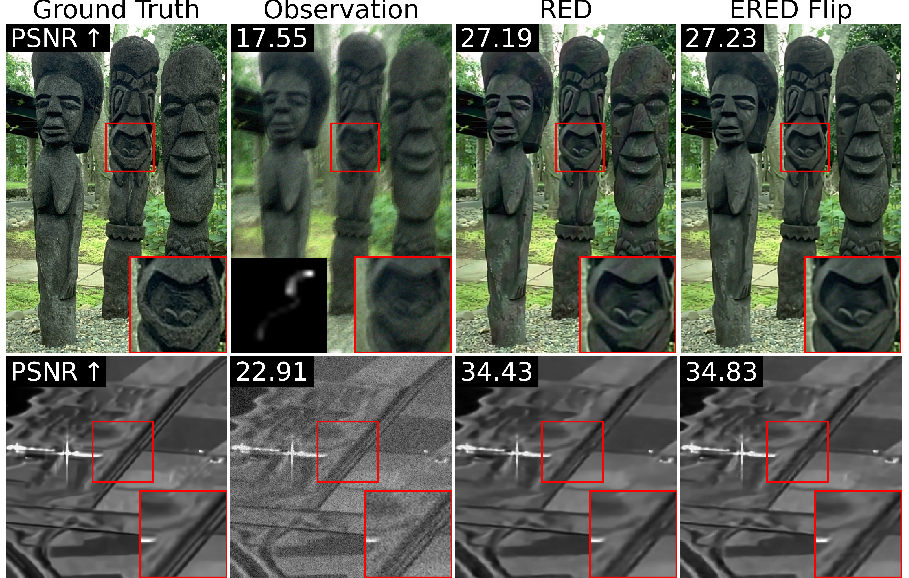

# Equivariant denoiser for image restoration

This repository contains associated with the paper [Equivariant denoiser for image restoration](https://arxiv.org/abs/2412.05343).

The goal is to add random transformations to the image before applying the denoiser. It allows to add $\pi$-equivariance on the underlying prior.

We apply these ideas for deblurring, inpainting, single image super-resolution and despeckling. We also provide a comparison of the denoising performances of the original denoiser and its equivariant versions.


*Figure 1 – Deblurring (a motion blur kernel with input noise level $\sigma_{y} = 5 / 255$) and despeckling (number of looks $50$) with RED and ERED with a GS-denoiser trained on natural images or SAR images (respectively). The set of transformations for ERED is \textit{random flip}.  ERED produces a better qualitative result than RED.*

## Environment definition

Our code that is based on Pytorch libraries, you need to create a conda environment with our libraries version

```
conda env create -f environment.yml
```

